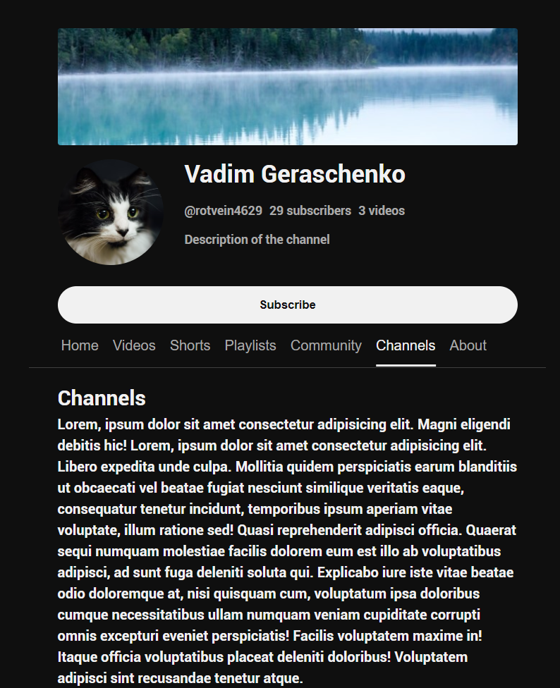

# Responsive landing page layout
## Enjoy it deployed!
https://rotvein.github.io/animated-accessible-tabs
## Intro 
### Layout screenshots

Desktop layout

 

Tablet layout

 

Mobile layout

 

### Animation demo

Switching tabs using keyboard navigation

 

Switching tabs using mouse

 

Tabs slider using keyboard navigation

 

Tabs slider  using mouse

 

## Description
### Technologies used
It is a responive layout made with `html`, `css`, `scss` and bundled with `webpack`. 

To make the layout responsive I've used `grid`'s, `flex`'s, `@media` queries.

Class names were assigned accoring to the `BEM` methodology.

Accessibility was achieved using `aria` properties and `tabindex` changing. 

I've implemented animations using `javascript`.
### Animations
#### Direaction-aware tab switching animation
By calculating dimensions such as e.g. `tab.offsetWidth` and coordinates such as e.g. `tab.offsetLeft` I've changed the custom properties (`--_transition-duration`, `--_underline_left`, `--_underline_width`) which affect the pseudo-element's (`.tabs__scroller::after`) transitions. 
#### Tabs slider
Tabs slider is also based on calculation of coordinates and dimensions and exerts its effect by changing the `.tabs__scroller`'s `scrollLeft` property.
### Accessibility
To ensure accessiblity I've written semantic `css` using `aria-selected`, `aria-controls` and assigned `role` properties to the elements. That will help to those who depend on screen readers. 

To ensure smooth keyboard navigation I've tested the website manually using my keyboard, and it works pretty handy. Tab switching and tabs scrolling can be done using either mouse clicks or `tab`, `tab + shift` and `enter` keypresses. 
